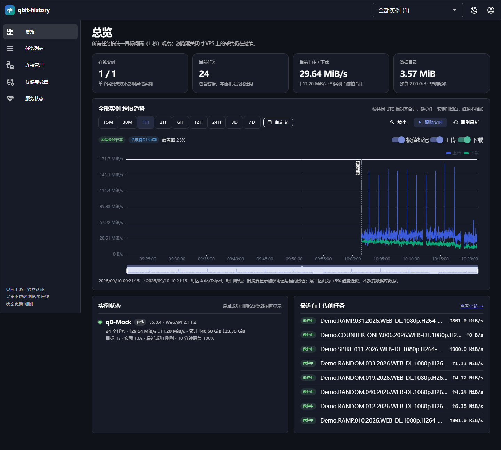

# qbit-history

[English](README.md) · **简体中文**

自托管的 **只读** qBittorrent 历史监控，支持一个或多个实例。它每秒采样**每一个**
实例的**每一个**任务，最近 24 小时逐秒无损保留，更早的数据做摘要压缩但**不丢失真实峰值**。
网页关掉也没关系 —— 采集跑在容器里，不依赖浏览器。

它**绝不修改 qBittorrent**。上游客户端只能调用五个接口，除登录外全是只读：

```
POST /api/v2/auth/login     GET /api/v2/app/version    GET /api/v2/app/webapiVersion
GET  /api/v2/sync/maindata  GET /api/v2/torrents/info
```

其他任何路径 —— 暂停、删除、修改设置，或是跳转到别的主机 —— 都会在**请求离开进程之前**
被 HTTP 传输层拒绝，测试套件会断言模拟的 qBittorrent 从未收到过白名单之外的请求。



## 特性

* **24 小时逐秒精度**，覆盖每一个任务，而不只是活跃的那些。没有「按活跃度采样」，
  没有热度评分。
* **如实记录断档**。请求失败会记为 gap，绝不用上一次的值补齐。覆盖率以百分比如实
  显示，而不是悄悄插值。
* **摘要保留峰值**。旧数据按 60 秒 / 300 秒分桶，但每个桶保留**真实的最大值、最小值，
  以及它们各自发生的精确时间戳**，平均值按时间加权计算 —— 绝不会出现「平均数的平均数」。
* **累计量正确**。上传/下载增量来自 qBittorrent 自身计数器在**连续样本**之间的差值，
  绝不通过对速度积分得到。计数器重置会开启新段，而不是凭空产生流量。
* **多实例隔离**，以 `实例 ID + 任务标识 + 世代` 三元组区分，所以某个 qB 宕机或重装
  不会污染另一个的历史。
* **占用可控**。实测每样本约 5.8 字节；500 个任务保留 30 天约 634 MiB。

## 快速开始

只需要 Docker（含 Compose v2）。Go 和 Node 仅在你想脱离 Docker 构建时才需要。

```bash
git clone https://github.com/hmtdpetn/qbit-history.git
cd qbit-history
cp .env.example .env

# 创建 ./data 目录和 ./secrets 下的 32 字节凭据主密钥：
sh scripts/init-secrets.sh

# 设置本应用自己的管理员密码（12-72 个字符）。
# 这和你的 qBittorrent 密码无关，是独立账号。
echo 'HISTORY_ADMIN_PASSWORD=choose-a-long-password' >> .env

docker compose up -d --build
```

打开 <http://127.0.0.1:28637>，用 `admin` 登录。然后把 `.env` 里的
`HISTORY_ADMIN_PASSWORD` 那一行删掉 —— 它只在创建账号时被读取一次，留着等于让密码
白白躺在文件里。

最后在 **连接管理** 页面添加你的 qBittorrent 实例。

## 连接 qBittorrent

地址是**在容器内部**解析的，这一点最容易踩坑：容器里的 `127.0.0.1` 指的是监控容器自己，
既不是你的宿主机，也不是 qBittorrent。

| qBittorrent 运行在哪 | 该填什么地址 |
|---|---|
| 同一台机器，非 Docker | `http://host.docker.internal:8080` |
| 局域网内另一台机器 | `http://192.168.1.x:8080` |
| Docker 容器里 | 容器名 + **容器内部**端口，如 `http://qbittorrent:8080` —— 需要下面的网络配置 |
| 反向代理后面 | 带完整前缀，如 `https://example.com/qb` |

`host.docker.internal` 在 Linux 上同样可用：Compose 文件里已显式映射到宿主机网关。

### 按容器名连接 qBittorrent 容器

由另一个 Compose 项目启动的容器处在那个项目自己的桥接网络里，所以本容器必须加入该网络。
先查出网络名：

```bash
docker inspect -f '{{range $k, $v := .NetworkSettings.Networks}}{{$k}} {{end}}' qbittorrent
```

把它写进 `.env` 的 `QB_NETWORK_1=...`，然后取消注释 `docker-compose.yml` 底部的 `qb1`
配置块**以及**服务 `networks:` 列表里的 `- qb1` 那一行，最后 `docker compose up -d`。

### 多个实例

数量没有上限。照上面的步骤重复 `qb2`、`qb3`…… 每个实例一个网络条目 + 一行 `- qbN`，
然后在界面里逐个添加。**已经共享同一网络的实例只需要一个条目**；两个条目绝不能指向
同一个网络，因为 Docker 拒绝把同一个容器重复接入同一网络。

## 支持的 qBittorrent 版本

基于 WebUI API v2，理论上 **4.1 及以上**都可以。两种登录协议都已适配：5.0 及以前的
`200 "Ok."` + `SID` cookie，以及 5.1 起的 `204 No Content` + `QBT_SID_<端口>` cookie
—— 后者正是许多旧客户端在新版 qBittorrent 上突然登录失败的原因。

**5.2.3 已在真机验证**。更早的版本遵循同样的公开 API，但没有在真实服务器上测试过。

## 配置

所有配置都在 `.env` 里，完整带注释的清单见 `.env.example`。

| 变量 | 默认值 | 含义 |
|---|---|---|
| `HISTORY_BIND` | `127.0.0.1` | 改成 `0.0.0.0` 可从局域网访问 |
| `HISTORY_PORT` | `28637` | 宿主机端口 |
| `HISTORY_DATA_DIR` | `./data` | SQLite 数据库位置 |
| `HISTORY_MASTER_KEY_FILE` | `./secrets/master.key` | 用于加密已保存的 qB 密码 |
| `HISTORY_SECURE_COOKIE` | `0` | **仅在**通过 HTTPS 访问时设为 `1` |
| `HISTORY_MEM_LIMIT` / `HISTORY_CPUS` | `256m` / `1.0` | 容器资源上限 |

保留天数（7/14/30）、采样间隔（1/2/5 秒）和存储预算（1 或 2 GiB）在网页界面里设置，
不在这里。

`secrets/master.key` 请**和 `data/` 分开备份**：没有它，已保存的 qBittorrent 密码
无法解密。

## 安全设计

* 独立的管理员账号（bcrypt），与 qBittorrent 的账号无关。
* 会话 cookie 带 HttpOnly 和 `SameSite=Strict`；所有写操作校验 `Origin` 和
  `X-CSRF-Token`；登录失败有频率限制（**成功的登录不计入**，所以多开几个标签页不会
  把自己锁在门外）。
* qBittorrent 凭据用 AES-GCM 加密，主密钥从独立文件只读挂载，并与实例 ID 绑定。
* 不做任何代理转发：界面无法让服务端去访问任意 URL。链路本地地址、组播地址和各云厂商
  的元数据地址一律拒绝，且 DNS 解析结果在真正建立连接前会再校验一次。
* 响应和日志中绝不包含凭据或会话 cookie 的值。
* 容器以 uid 65532 运行，根文件系统只读，`cap_drop: ALL`，`no-new-privileges`，
  基于 `distroless/static`，**镜像里连 shell 都没有**。
* 界面默认只绑定 `127.0.0.1`，在你主动开放之前不会暴露。

需要说明的是：容器里确实存有真实的 qBittorrent 凭据。只读性由接口白名单和相应的测试
保证，而不是由 qBittorrent 端的权限保证 —— qBittorrent 本身没有只读账号这种东西。

## 设计要点

* **存储分层**：原始数据 24 小时（列式差分/游程 + zstd 无损压缩），60 秒桶保留 72 小时，
  300 秒桶保留到设定期限，三层物理上重叠存在，容量预测已计入重叠部分。格式细节见
  [`docs/codec.md`](docs/codec.md)。
* **趋势显示**：对于旧数据，若连续若干个完整桶的最大/最小值都落在时间加权均值的 ±5%
  以内，则画成一条水平线段（60 秒层最长 15 分钟，300 秒层最长 60 分钟）。这**只影响绘图**
  —— 存储的数值和字节计数从不被修改，极值保留其真实时间戳并以标记点显示。
* **删除判定**：qBittorrent 主动汇报为已移除的任务成为候选，在 8 秒后的一次新的完整读取
  中确认；仅仅是「不再出现」的任务则需要间隔 ≥30 秒、跨度 ≥60 秒的三次确认。启动或重连后
  120 秒内不删除任何东西。若某实例一次性消失 `max(10, 20%)` 的任务，删除会被挂起，直到
  你在界面上确认 —— 因为大批量消失既可能是真删了，也可能是 qB 出了故障（掉盘、配置丢失），
  自动清理不可逆。**任何情况下只删除本应用自己的历史数据。**
* **空间控制**：数据库通过 `max_page_count` 限制在预算的 75%，WAL 上限 128 MiB，另有
  宿主机剩余空间保护和恢复时的迟滞判断。**绝不会为了腾空间去删除 qBittorrent 的任务。**
* **带宽**：超过 1400 字节的响应会 gzip 压缩。一张 24 小时图表从约 418 kB 降到约 24 kB
  —— 在 SSH 隧道这种单次往返就要几百毫秒的链路上，这个差别是十几秒和一秒的区别。

## 实测数据

来自 [`docs/test-report.md`](docs/test-report.md) 和 [`reports/`](reports/) 中
26 个模拟小时的基准测试：

| 项目 | 数值 |
|---|---|
| 每个原始样本 | **5.8 字节**（空闲时 0.27 字节，最坏情况 18.9 字节） |
| 每个 60 秒 / 300 秒摘要桶 | 29.7 字节 / 40.3 字节 |
| CPU（500 个任务） | **每天 213 CPU-秒**（约 0.003 核） |
| Go 堆内存峰值 | 7.3 MiB |
| 24 小时单序列查询 | 58 毫秒 |
| 500 任务 × 30 天 | **634 MiB** |
| 真实容器，60 个任务 1 Hz | 10.1 MiB 内存，0.17% CPU |

## 构建与开发

镜像由 `docker compose up -d --build` 从源码构建，因此**Docker 支持的任何架构都能用**，
包括 arm64（树莓派、Apple Silicon）。没有预构建镜像，也就不存在被架构锁死的问题。

脱离 Docker 运行，搭配模拟的 qBittorrent：

```bash
sh scripts/dev.sh     # 构建两个二进制和界面，然后同时启动 mock qB 和服务端
# http://127.0.0.1:28637   admin / local-demo-password
# → 连接管理 → 添加 http://127.0.0.1:18080，用户名 admin，密码 adminadmin
```

手动执行：

```bash
go test ./... && go build -o bin/history ./cmd/history && go build -o bin/mockqb ./cmd/mockqb
(cd web && npm ci && npm run build)
./bin/mockqb -listen 127.0.0.1:18080 -torrents 40 &
HISTORY_ADMIN_PASSWORD=local-demo-password ./bin/history -data .local/data -master-key .local/master.key -listen 127.0.0.1:28637
```

模拟器提供 `/_mock/requests` 让你自己验证接口白名单，以及
`/_mock/mode?mode=html|truncated|error|forbidden|hang` 用于注入各种故障。它刻意模拟了
qBittorrent 5.2 的几个特性：`204` 登录响应、`QBT_SID_<端口>` cookie，以及增量同步时
**省略** `full_update` 字段。

`go test ./...` 共 **58 个测试**；`go vet ./...` 和竞态检测均无告警。

### 目录结构

```
cmd/history         服务端二进制（另有 -healthcheck、-version）
cmd/mockqb          模拟的 qBittorrent WebUI API
cmd/benchmark       带模拟时钟的存储流水线基准测试
internal/upstream   白名单 qB 客户端（URL 规范化、SSRF 防护、拒绝跳转）
internal/collector  每实例状态机、删除生命周期、写入循环
internal/codec      块容器 + 列式编码
internal/rollup     时间加权摘要桶
internal/store      SQLite 表结构、帧/块、封块、保留、预算、认证
internal/query      序列/总览查询、抽稀、平坦化
internal/api        HTTP API + 静态界面
web/                Vue 3 + Vuetify + ECharts 界面
```

## API

全部在 `/api/v1` 下，cookie 会话，写操作需 `X-CSRF-Token`：

`POST auth/login` · `POST auth/logout` · `GET auth/session` · `POST auth/password` ·
`GET/POST instances` · `POST instances/test` · `PATCH/DELETE instances/{id}` ·
`POST instances/{id}/reconnect` · `POST instances/{id}/confirm-history-purge` ·
`POST instances/{id}/confirm-bulk-removal` · `GET instances/{id}/series` ·
`GET instances/{id}/torrent-by-key/{key}` · `GET torrents` · `GET torrents/{id}` ·
`GET torrents/{id}/series` · `GET overview/series` · `GET/PATCH settings` ·
`GET storage/usage` · `GET storage/forecast` · `GET status` · `GET events`。

序列查询接受 `start`/`end`（UTC 毫秒，左闭右开）、`metric=speed|cumulative`、
`counter=reported|delta` 和 `max_points`，返回数据来源、分辨率、覆盖率、断档、极值
和估算标记。

## 已知局限

* 1 秒轮询不是抓包。亚秒级的瞬时峰值，以及 qBittorrent 自身的刷新频率，都会限制实际
  可达的分辨率。
* 一个任务如果在两次轮询之间被删除又重新添加，且各项特征完全一致，无法被区分出来。
* 指向同一个 qBittorrent 的两个不同 DNS 名无法自动识别；界面只会对规范化后完全相同的
  URL 给出提示。
* 界面目前只有中文。

## 许可证

MIT —— 见 [LICENSE](LICENSE)。
